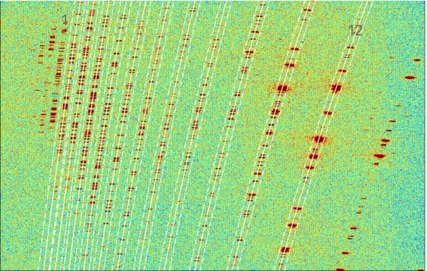

# `pyexspec`
An automated pipeline for reducing 2D spectra of instruments and is a modified version of [bfosc](https://github.com/hypergravity/bfosc/)

Authors:
- Jiao Li
- Zhang Bo

 

## Installation

1. install `songcn` package
    - `pip install -U git+git://github.com/lidihei/songcn`
    - `pip show songcn` should be at least `0.0.9`
1.1.  install 'songcn' package
    - `git clone https://github.com/lidihei/songcn.git`
    - `bash install.sh`
2. install `pyexspec` package
    - `git clone https://github.com/lidihei/pyexspec.git`
    - `cd pyexspec`
    - `pip install .`

## Extracting spectrum of E9G10 of Xinglong 216cm
    - `cd pyexspec/bfoscE9G10/gui`
    - `python app.py`
- - if extract BFOSC the rot90 must be selected

- - bfosc orders reference

   

## bfosc E9G10

## Manually callibrate wavelength
-  `cd wvcalib`
- `$python wvclib_app.py`
- - when set value of emission line, you shoud press "Enter/Return" keyboard after input the value into the table.

